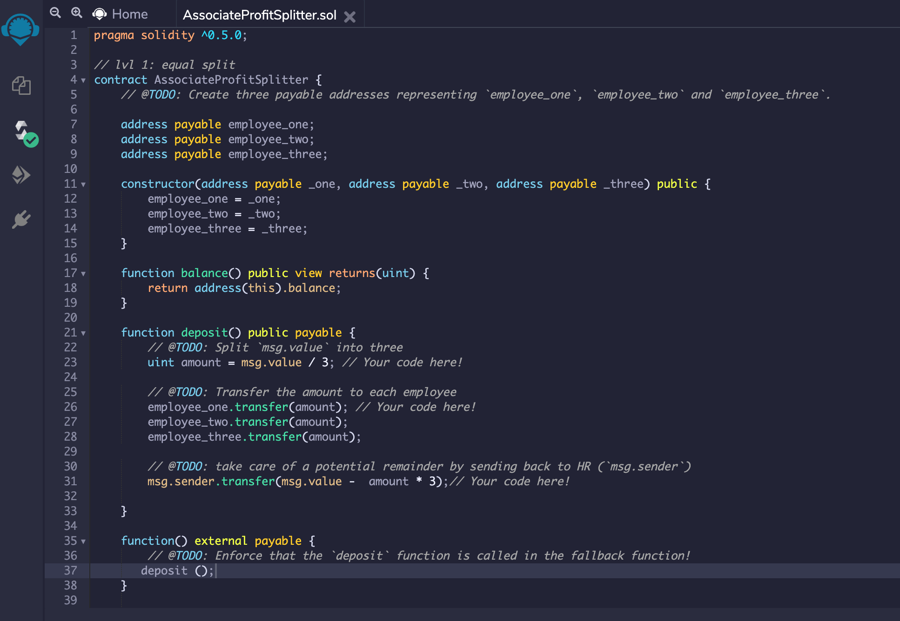
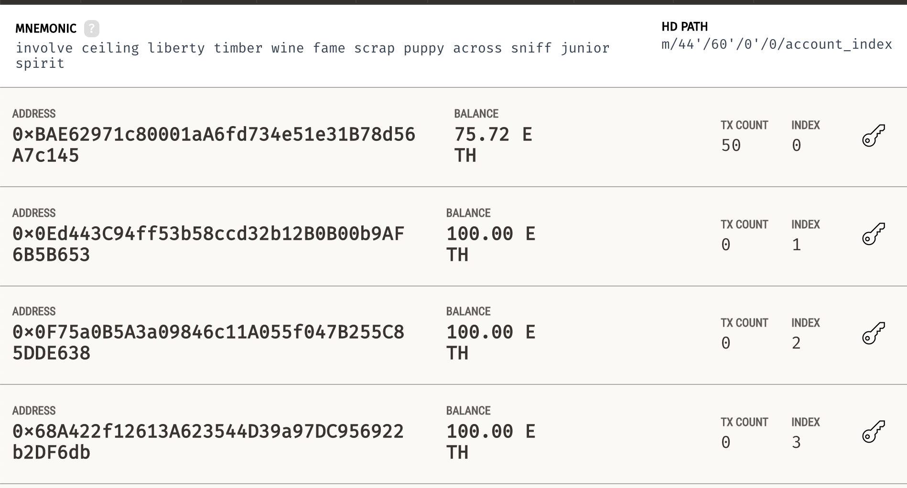
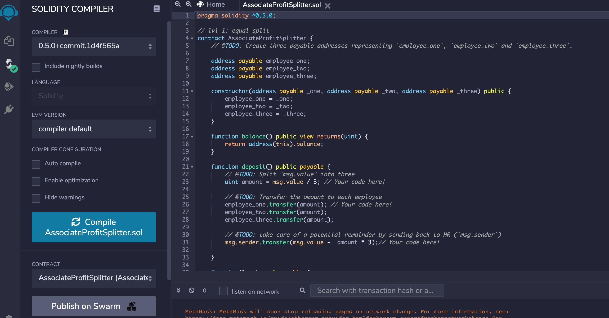
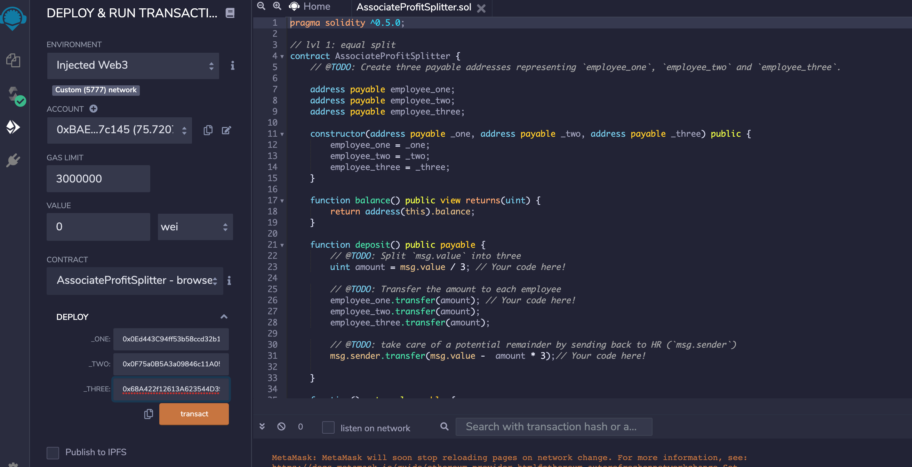
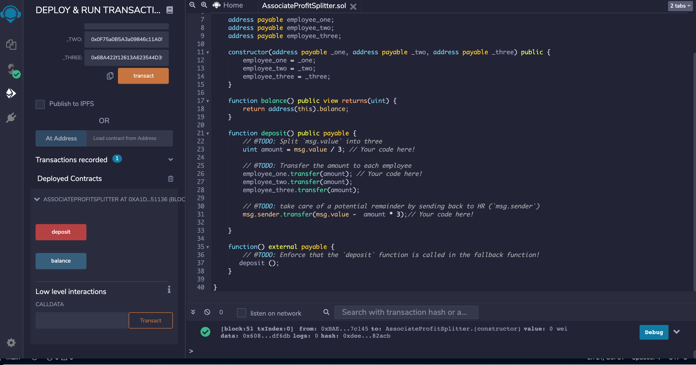
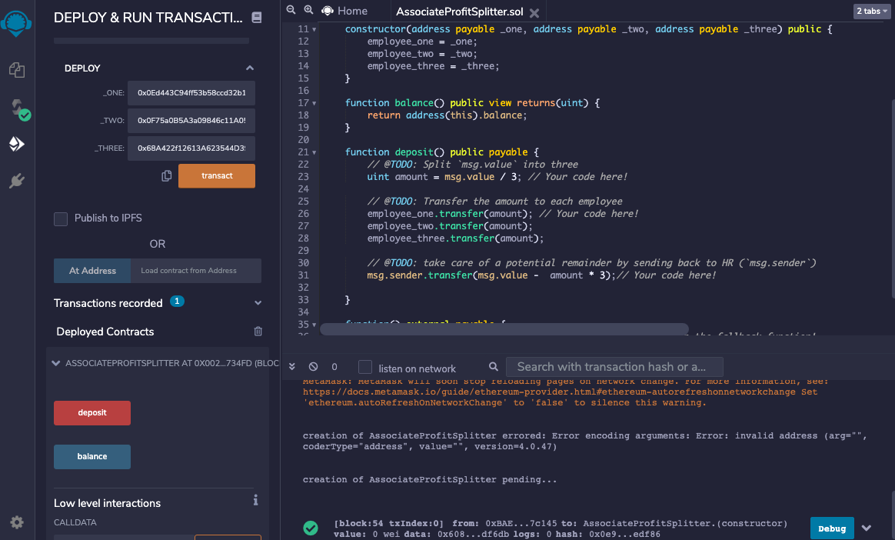
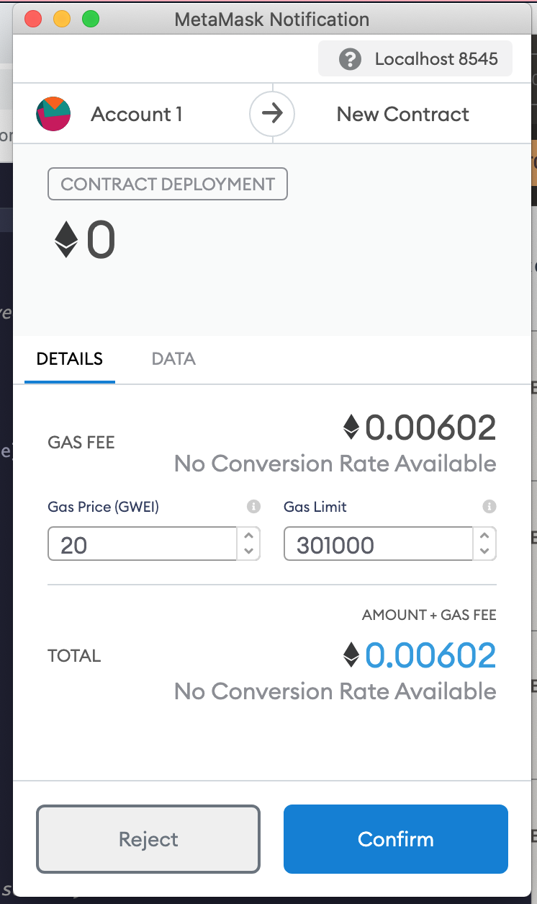
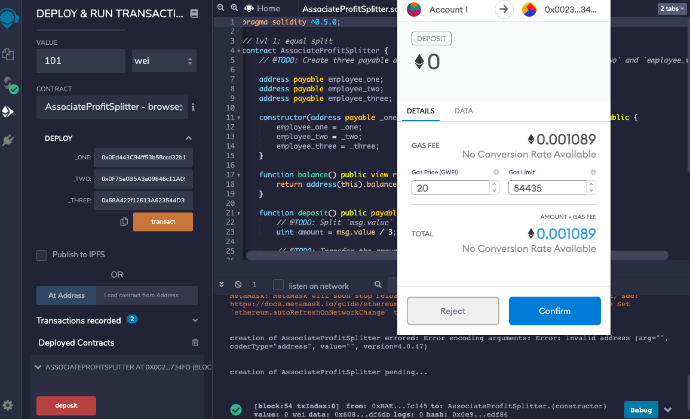
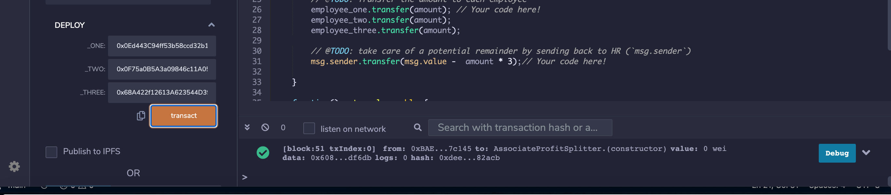

## Smart contract code for `AssociateProfitSplitter.sol`

## The amount in addresses that represent `employee_one`, `employee_two`, and `employee_three` before deployment of transaction.

## The smart contract `AssociateProfitSplitter.sol` is compiled.

## The smart contract `AssociateProfitSplitter.sol` is deployed.

## The smart contract `AssociateProfitSplitter.sol` executes a deposit.

## The Transaction is reflected in MetaMask.

## The transaction amounts are reflected in the ledger.

