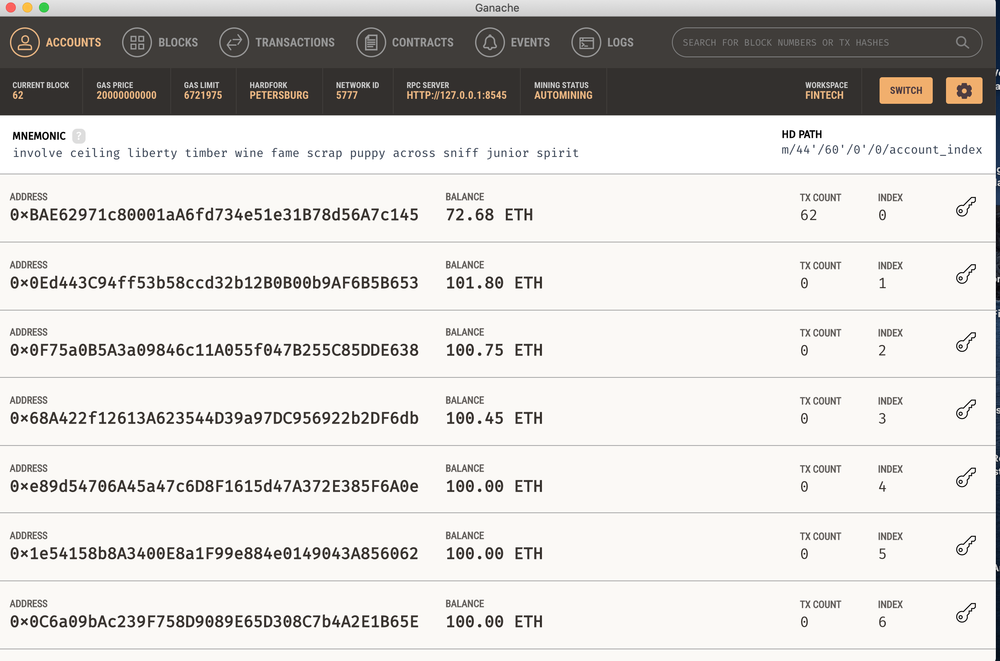
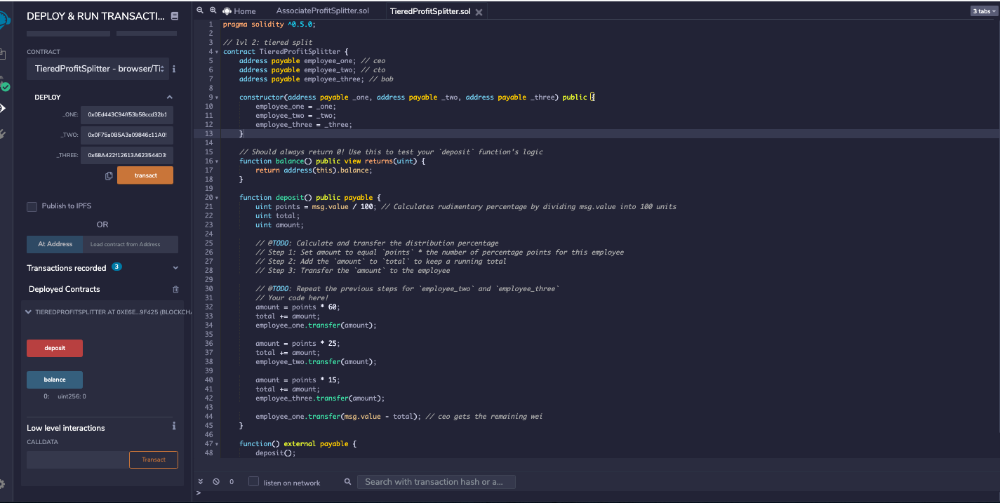
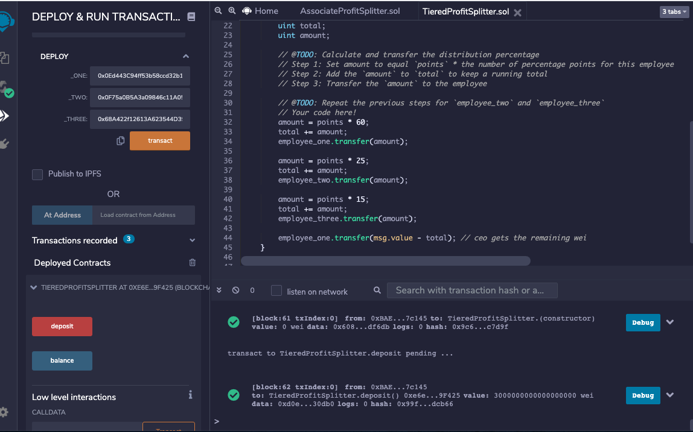

### The amount of ETH in addresses that represent `employee_one`, `employee_two`, and `employee_three` before deployment of transaction.

### TieredProfitSplitter.sol compiled & deployed

### Deposit reflected in MetaMask.
.png)

### The smart contract has confirmed the deposit to the employee accounts.

